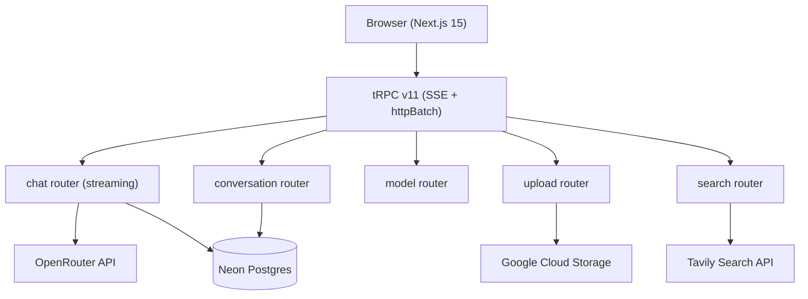

# Farasa

Production AI chat system with streaming, search, file attachments, voice, and agent-rendered UI.

## Architecture



## Tech Stack

| Layer | Technology | Notes |
|---|---|---|
| Framework | Next.js 15 App Router | Standalone output for Docker |
| Language | TypeScript 5 | `noUncheckedIndexedAccess`, strict |
| Runtime | Bun 1.5+ | Package manager + runtime |
| UI | React 19 | Server + Client components |
| Styling | Tailwind CSS v4 | CSS token design system |
| Animation | Framer Motion | Reduced-motion aware |
| Components | shadcn/ui | Accessible, owned components |
| API layer | tRPC v11 | Type-safe, SSE subscriptions |
| Database ORM | Drizzle ORM | Type-safe, Neon Postgres |
| Auth | Auth.js v5 | Google OAuth, DrizzleAdapter |
| AI Gateway | OpenRouter | Dynamic model registry |
| Search | Tavily | Web + image search |
| Storage | Google Cloud Storage | Presigned URL uploads |
| Agent UI | @a2ui-sdk v0.8 | Custom catalog with shadcn adapters |
| PWA | @serwist/next v9 | Service worker, offline support |
| Deployment | Docker + Cloud Run | Multi-stage Bun image |

## Environment Variables

| Variable | Required | Description |
|---|---|---|
| `AUTH_SECRET` | Yes | Auth.js secret — generate with `bunx auth secret` |
| `AUTH_GOOGLE_ID` | Yes | Google OAuth client ID |
| `AUTH_GOOGLE_SECRET` | Yes | Google OAuth client secret |
| `OPENROUTER_API_KEY` | Yes | OpenRouter API key |
| `DATABASE_URL` | Yes | Neon Postgres connection string |
| `TAVILY_API_KEY` | Yes | Tavily search API key |
| `GCS_BUCKET_NAME` | Yes | Google Cloud Storage bucket name |
| `GCS_PROJECT_ID` | Yes | Google Cloud project ID |
| `GOOGLE_APPLICATION_CREDENTIALS` | Local only | Path to GCP service account JSON |
| `NEXT_PUBLIC_APP_URL` | Yes | App URL for OAuth callbacks |

## Local Setup

```bash
# Install dependencies
bun install

# Configure environment
cp .env.example .env
# Fill in all required values in .env

# Generate and run database migrations
bun run db:generate
bun run db:migrate

# Start dev server
bun run dev
```

Open [http://localhost:3000](http://localhost:3000).

## Production Build

```bash
bun run type-check
bun run build
```

## Docker

```bash
# Build and run locally
docker build -t farasa .
docker run -p 3000:3000 --env-file .env farasa
```

## Cloud Run Deployment

```bash
docker build -t farasa .
docker tag farasa gcr.io/YOUR_PROJECT/farasa
docker push gcr.io/YOUR_PROJECT/farasa

gcloud run deploy farasa \
  --image gcr.io/YOUR_PROJECT/farasa \
  --platform managed \
  --region me-central1 \
  --allow-unauthenticated
```

## Key Design Decisions

- **tRPC SSE subscriptions** for streaming AI responses — no polling, zero dead air
- **Zod SSOT** — all cross-boundary types via `z.infer<typeof Schema>`, never handwritten
- **Dynamic model registry** — fetches OpenRouter `/v1/models` at runtime, stale-on-error cache
- **A2UI protocol** — AI outputs structured JSONL; custom catalog maps to shadcn/ui components
- **CSS token design system** — `--bg-root`, `--accent`, `--provider-*` etc. — never Tailwind color names in components

## Health Check

```bash
curl http://localhost:3000/api/health
# {"status":"ok","timestamp":"2026-..."}
```
