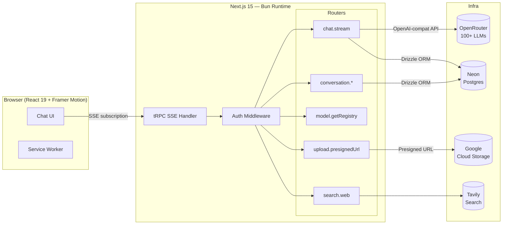

<!-- Update CI badge URL to your actual GitHub repo path after first push -->

[](https://github.com/OWNER/farasa/actions/workflows/ci.yml)
[](https://www.typescriptlang.org/)
[](https://nextjs.org/)
[](https://bun.sh/)
[](LICENSE)

# Farasa

**Production AI chat system with real-time multi-phase streaming, LLM auto-routing across 100+ models,
web search with image galleries, multi-modal file attachments, voice I/O, and agent-rendered UI
components.**

Built on Next.js 15 App Router · tRPC v11 SSE · React 19 · Bun · Neon Postgres · GCP Cloud Run

**[Live Demo →](https://farasa.example.com)** · [Architecture](#architecture) · [Setup](#setup) ·
[API Reference](#api-reference)

---

## Features

|     | Feature                  | Details                                                                          |
| --- | ------------------------ | -------------------------------------------------------------------------------- |
| ⚡  | **Real-time streaming**  | 7-phase SSE stream: routing → thinking → tools → text → A2UI. Zero dead air.     |
| 🧠  | **LLM auto-router**      | A fast classifier selects the optimal model per prompt from 100+ providers       |
| 🔍  | **Web search**           | Tavily API — structured result cards with source attribution and image gallery   |
| 📎  | **File attachments**     | Multi-modal uploads via GCS presigned URLs (images, PDFs, text)                  |
| 🎙️  | **Voice I/O**            | Web Speech API: STT mic input and TTS message playback                           |
| 🎨  | **Agent UI (A2UI)**      | AI generates interactive React components (cards, forms, tables) via `@a2ui-sdk` |
| 🗂️  | **Conversation history** | Full CRUD, sidebar navigation, pinning, Markdown export                          |
| 🔒  | **Security**             | Google OAuth, per-user DB isolation, rate limiting, AES-GCM token encryption     |
| 📱  | **PWA**                  | Mobile-first, offline-capable, installable via `@serwist/next`                   |
| 🌓  | **Dark / light theme**   | System preference detection, CSS token system, Shiki theme switching             |

---

## Architecture



**Transport**: `splitLink` — subscriptions → `httpSubscriptionLink` (SSE), queries/mutations →
`httpBatchLink`. Single endpoint at `/api/trpc/[trpc]`.

**Streaming protocol**: `StreamChunk` discriminated union — `status | model_selected | thinking |
tool_start | tool_result | text | a2ui | error | done`. Each chunk is emitted as the server
progresses through phases. The client state machine (`useChatStream`) renders all phases
simultaneously in the message bubble.

---

## Tech Stack

| Layer        | Technology                                               | Version       | Notes                                     |
| ------------ | -------------------------------------------------------- | ------------- | ----------------------------------------- |
| Runtime      | [Bun](https://bun.sh)                                    | 1.5+          | Native TypeScript, fast installs          |
| Framework    | [Next.js](https://nextjs.org)                            | 15 App Router | RSC, middleware, React 19                 |
| API          | [tRPC](https://trpc.io)                                  | v11           | End-to-end type safety + SSE streaming    |
| Client state | [TanStack Query](https://tanstack.com/query)             | v5            | Caching, optimistic updates               |
| AI gateway   | [OpenRouter](https://openrouter.ai)                      | —             | Unified API for 100+ models               |
| AI SDK       | `openai` npm                                             | latest        | OpenRouter-compatible, `baseURL` override |
| Agent UI     | `@a2ui-sdk/react`                                        | v0.4          | Agent-generated interactive components    |
| Validation   | [Zod](https://zod.dev)                                   | latest        | SSOT — schemas derive TypeScript types    |
| Auth         | [Auth.js](https://authjs.dev)                            | v5            | Google OAuth, middleware route protection |
| ORM          | [Drizzle ORM](https://orm.drizzle.team)                  | latest        | Type-safe, SQL-transparent                |
| Database     | [Neon Postgres](https://neon.tech)                       | serverless    | Scales to zero, HTTP driver               |
| Storage      | [Google Cloud Storage](https://cloud.google.com/storage) | —             | Presigned URL direct uploads              |
| Search       | [Tavily](https://tavily.com)                             | latest        | AI-optimised search with images           |
| Styling      | [Tailwind CSS](https://tailwindcss.com)                  | v4            | CSS custom property token system          |
| UI           | [shadcn/ui](https://ui.shadcn.com)                       | latest        | Owned, accessible components              |
| Motion       | [Framer Motion](https://www.framer.com/motion/)          | latest        | Spring physics, FLIP, gesture             |
| Code         | [Shiki](https://shiki.matsu.io)                          | latest        | VS Code engine, SSR-safe                  |
| Markdown     | react-markdown + plugins                                 | latest        | GFM, sanitized HTML, KaTeX math           |
| PWA          | [@serwist/next](https://serwist.pages.dev)               | latest        | Service worker, offline shell             |
| Deployment   | [GCP Cloud Run](https://cloud.google.com/run)            | —             | `me-central1`, scales to zero             |

---

## Project Structure

```
src/
├── app/                         # Next.js 15 App Router
│   ├── (auth)/login/            # Login page — Google OAuth sign-in
│   ├── (protected)/chat/        # Main chat UI (auth-gated)
│   │   └── [id]/                # Individual conversation view
│   ├── api/
│   │   ├── trpc/[trpc]/         # tRPC HTTP handler (SSE + batch)
│   │   ├── auth/[...nextauth]/  # Auth.js OAuth callbacks
│   │   └── health/              # Load balancer health endpoint
│   └── manifest.ts / sw.ts      # PWA manifest + service worker
│
├── server/
│   ├── routers/
│   │   ├── chat.ts              # chat.stream — 7-phase SSE streaming
│   │   ├── conversation.ts      # CRUD, pagination, pin, Markdown export
│   │   ├── model.ts             # Live registry from OpenRouter API
│   │   ├── search.ts            # Tavily web search
│   │   └── upload.ts            # GCS presigned URL + confirmation
│   └── trpc.ts                  # Context, auth middleware, rate limiting
│
├── features/
│   ├── chat/                    # Chat container, input, message list, model selector
│   ├── stream-phases/           # Phase bar, thinking block, tool execution cards
│   ├── a2ui/                    # A2UI renderer + shadcn/ui catalog adapters
│   ├── search/                  # Result cards, image gallery
│   ├── sidebar/                 # Conversation list, navigation, user menu
│   ├── markdown/                # Renderer, Shiki code blocks, copy button
│   ├── voice/                   # STT mic input, TTS playback
│   └── pwa/                     # Install prompt, offline banner
│
├── lib/
│   ├── ai/                      # OpenRouter client, model router, registry, tools
│   ├── db/                      # Drizzle schema, relations, client, migrations
│   ├── upload/                  # GCS presigned URL generation + sanitization
│   ├── search/                  # Tavily wrapper
│   ├── security/                # Rate limiter (sliding window), AES-GCM token crypto
│   └── utils/                   # cn, format, error messages, motion presets
│
├── schemas/                     # Zod SSOT — message, conversation, model, search, upload
├── config/                      # constants.ts, env.ts, routes.ts, models.ts, prompts.ts
├── types/                       # Pure TypeScript domain types
├── styles/themes.css            # CSS custom properties — dark + light token system
└── middleware.ts                # Auth guard on /chat/* and /api/trpc/*
```

---

## API Reference

All APIs are type-safe tRPC procedures at `/api/trpc/[trpc]`.

### `chat.stream` — Core streaming endpoint

```ts
// SSE subscription — emits StreamChunk discriminated union
chat.stream({
  model: string | 'auto', // model ID or 'auto' for LLM router
  messages: Message[],
  sessionId: string,
  mode: 'chat' | 'search',
  attachmentIds?: string[],
})

// Chunk sequence (in order):
{ type: 'status';         phase: StreamPhase; message: string }
{ type: 'model_selected'; model: ModelConfig; reasoning: string }
{ type: 'thinking';       content: string; isComplete: boolean }
{ type: 'tool_start';     toolName: string; input: unknown }
{ type: 'tool_result';    toolName: string; result: unknown }
{ type: 'text';           content: string }
{ type: 'a2ui';           jsonl: string }
{ type: 'done';           usage?: TokenUsage }
{ type: 'error';          message: string; code?: string }
```

### Conversations

```ts
conversation.list({ limit?, cursor?, search? })   // Paginated, pinned first
conversation.getById({ id })                       // Conversation + messages
conversation.create({ title? })                    // New conversation
conversation.updateTitle({ id, title })            // Rename
conversation.delete({ id })                        // Cascade: messages + attachments
conversation.generateTitle({ conversationId })     // LLM-generated title
conversation.exportMarkdown({ id })                // Full Markdown export string
```

### Models

```ts
model.list() // All models (cached from OpenRouter, 1-hour TTL)
model.getById({ id }) // Model metadata + capabilities + pricing
model.refresh() // Clear cache and reload from OpenRouter
```

### Search & Upload

```ts
search.web({ query, maxResults? })             // Tavily → structured results + images
upload.presignedUrl({ filename, mimeType })    // GCS signed URL + attachment DB record
upload.confirmUpload({ id, contentType })      // Mark attachment confirmed post-upload
```

---

## Environment Variables

| Variable                         | Required | Description                                                    |
| -------------------------------- | -------- | -------------------------------------------------------------- |
| `AUTH_SECRET`                    | ✓        | Auth.js signing secret — `bunx auth secret`                    |
| `AUTH_GOOGLE_ID`                 | ✓        | Google OAuth client ID                                         |
| `AUTH_GOOGLE_SECRET`             | ✓        | Google OAuth client secret                                     |
| `OPENROUTER_API_KEY`             | ✓        | [openrouter.ai/keys](https://openrouter.ai/keys)               |
| `DATABASE_URL`                   | ✓        | Neon Postgres connection string                                |
| `TAVILY_API_KEY`                 | ✓        | Starts with `tvly-` — [app.tavily.com](https://app.tavily.com) |
| `GCS_BUCKET_NAME`                | ✓        | Google Cloud Storage bucket                                    |
| `GCS_PROJECT_ID`                 | ✓        | GCP project ID                                                 |
| `GOOGLE_APPLICATION_CREDENTIALS` | —        | Service account JSON path (local dev only)                     |
| `NEXT_PUBLIC_APP_URL`            | ✓        | App base URL — OAuth callbacks + OpenRouter Referer            |
| `AUTH_URL`                       | —        | Auth.js callback URL (defaults to `NEXT_PUBLIC_APP_URL`)       |
| `NODE_ENV`                       | —        | `development` \| `production` (set by runtime)                 |

---

## Setup

### Prerequisites

- [Bun 1.5+](https://bun.sh/docs/installation)
- Neon Postgres database ([neon.tech](https://neon.tech) — free tier available)
- GCP project with Cloud Storage bucket + Google OAuth credentials
- OpenRouter API key and Tavily API key

### Local Development

```bash
# 1. Install dependencies
bun install

# 2. Configure environment
cp .env.example .env
# Fill in credentials (see table above)

# 3. Apply database migrations
bun run db:migrate

# 4. Start dev server on port 3010
bun run dev
```

Open [http://localhost:3010](http://localhost:3010).

### Quality Gates

```bash
bun run type-check    # TypeScript strict check (zero errors required)
bun run lint          # ESLint + SSOT literal enforcement
bun run format:check  # Prettier formatting check
bun test              # Schema and unit tests
```

Pre-commit hooks enforce all of the above automatically.

### Database

```bash
bun run db:generate  # Generate migration files from schema changes
bun run db:migrate   # Apply pending migrations to Neon
bun run db:push      # Push schema directly (dev only — no migration file)
bun run db:studio    # Drizzle Studio GUI on port 4983
```

---

## Docker

### Build

```bash
docker build \
  --build-arg NEXT_PUBLIC_APP_URL=http://localhost:3010 \
  -t farasa .
```

### Run with Postgres

```bash
# Interactive menu (recommended for local dev)
./start.sh

# Direct Docker Compose
docker compose -f docker/docker-compose.yml up
```

### Service Ports

| Service     | External Port | Description                              |
| ----------- | ------------- | ---------------------------------------- |
| Next.js app | **3010**      | Main application                         |
| Postgres    | 5433          | PostgreSQL (maps to 5432 internally)     |
| Adminer     | 8080          | Database web UI (`./start.sh --adminer`) |

---

## Deployment — GCP Cloud Run

CI/CD is fully automated via GitHub Actions. CI runs on every push and PR; CD deploys to Cloud
Run on every push to `main`.

### One-time GCP setup

```bash
export PROJECT_ID=your-project-id

gcloud services enable run.googleapis.com artifactregistry.googleapis.com

gcloud artifacts repositories create farasa \
  --repository-format=docker --location=me-central1 \
  --description="Farasa Docker images"

gcloud iam service-accounts create farasa-gh-actions \
  --display-name="Farasa GitHub Actions"

gcloud projects add-iam-policy-binding $PROJECT_ID \
  --member="serviceAccount:farasa-gh-actions@$PROJECT_ID.iam.gserviceaccount.com" \
  --role="roles/run.admin"

gcloud projects add-iam-policy-binding $PROJECT_ID \
  --member="serviceAccount:farasa-gh-actions@$PROJECT_ID.iam.gserviceaccount.com" \
  --role="roles/artifactregistry.writer"

# Generate key → add to GitHub as secret GCP_SA_KEY
gcloud iam service-accounts keys create key.json \
  --iam-account=farasa-gh-actions@$PROJECT_ID.iam.gserviceaccount.com
cat key.json  # copy to GitHub secret
rm key.json
```

### GitHub repository configuration

**Secrets** (Settings → Secrets → Actions):
`GCP_SA_KEY`, `AUTH_SECRET`, `AUTH_GOOGLE_ID`, `AUTH_GOOGLE_SECRET`, `OPENROUTER_API_KEY`,
`DATABASE_URL`, `TAVILY_API_KEY`, `GCS_BUCKET_NAME`, `GCS_PROJECT_ID`

**Variables** (Settings → Variables → Actions):
`GCP_PROJECT_ID`, `GCP_REGION` = `me-central1`,
`GCP_ARTIFACT_REGISTRY` = `me-central1-docker.pkg.dev`,
`CLOUD_RUN_SERVICE_NAME` = `farasa`,
`NEXT_PUBLIC_APP_URL` = your Cloud Run service URL

---

## Key Design Decisions

### SSE over WebSocket

Server-Sent Events work natively through corporate proxies, require no upgrade handshake, and
benefit from automatic browser reconnection. For unidirectional server → client AI streams, SSE
is simpler and more operationally reliable. The `httpSubscriptionLink` transport is already in
place — WebSocket can be layered on top if bidirectional messaging is needed.

### Zod as the single source of truth

Every type that crosses a module boundary is a Zod schema in `src/schemas/`. TypeScript types are
derived exclusively via `z.infer<typeof Schema>`, eliminating the class of bugs where runtime
validation and TypeScript types drift apart. The same schemas validate tRPC inputs, database
writes, and client-side forms.

### OpenRouter over direct provider APIs

One API key and a single OpenRouter `baseURL` replace a dozen provider SDKs. The live model
registry fetches all available models — with real pricing and capability metadata — directly from
`/api/v1/models` with a 1-hour cache. The LLM auto-router classifies intent and selects the
optimal model per request, with its reasoning shown to the user in real time.

### A2UI for agent-rendered UI

The `@a2ui-sdk/react` renderer allows the AI to generate structured, interactive UI components
(charts, forms, tables, cards) via the A2UI protocol — without hardcoding every possible output
format. Custom catalog adapters map A2UI types to shadcn/ui components, ensuring design-system
consistency across both AI-generated and hand-coded surfaces. All A2UI chunks are structurally
validated before dispatch.

### CSS custom property token system

All colors, shadows, and border radii live as CSS custom properties in `src/styles/themes.css`.
Components reference `var(--bg-surface)`, `var(--accent)`, etc. — never hardcoded hex values or
Tailwind color names. Dark/light mode switches by toggling a class on `:root`, with zero
JavaScript layout flash.

### Architecture trade-offs

| Decision      | Chosen         | Alternative    | Reason                                                          |
| ------------- | -------------- | -------------- | --------------------------------------------------------------- |
| API layer     | tRPC           | REST / GraphQL | End-to-end types without codegen; SSE built-in                  |
| ORM           | Drizzle        | Prisma         | Lighter, no query engine, SQL-transparent, edge-safe            |
| Streaming     | SSE            | WebSockets     | Simpler, proxy-friendly, auto-reconnect                         |
| AI routing    | LLM classifier | Rule-based     | Adapts to novel prompt patterns automatically                   |
| Auth          | Auth.js v5     | Lucia / custom | Maintained, Google OAuth built-in, middleware-native            |
| Rate limiting | In-memory      | Redis          | Sufficient for single Cloud Run instance; Redis path documented |

---

## Production Improvements

Documented paths for scaling beyond the current single-instance deployment:

| Improvement               | Current                 | Production path                                             |
| ------------------------- | ----------------------- | ----------------------------------------------------------- |
| **Rate limiting**         | In-memory, per-instance | Redis shared store (Upstash)                                |
| **Observability**         | None                    | OpenTelemetry → Cloud Trace (streaming phases + AI latency) |
| **Provider failover**     | None                    | Secondary OpenRouter endpoint + exponential backoff         |
| **DB connection pooling** | Neon serverless HTTP    | PgBouncer for sustained high-traffic                        |
| **Real-time collab**      | SSE unidirectional      | Socket.IO or Partykit for multi-user rooms                  |
| **E2E testing**           | Schema unit tests       | Playwright — auth flows + streaming scenarios               |
| **Content moderation**    | None                    | OpenAI Moderation API or Perspective API                    |
| **Cost tracking**         | Token counts stored     | Per-user billing dashboard + budget alerts                  |
| **Search caching**        | None                    | Redis TTL cache keyed by query hash                         |
| **Image CDN**             | Direct GCS URLs         | Cloud CDN in front of GCS for attachment thumbnails         |

---

## Contributing

### Commit format (enforced by commitlint)

```bash
feat(chat): add thinking block expansion animation
fix(upload): prevent orphaned attachments after timeout
chore(ci): pin setup-bun action to v2
docs(readme): add production improvements table
```

Types: `feat | fix | chore | docs | style | refactor | perf | test | build | ci | revert`

### Git hooks (run automatically)

| Hook         | Triggers     | Runs                                                         |
| ------------ | ------------ | ------------------------------------------------------------ |
| `pre-commit` | `git commit` | lint-staged (prettier + eslint on staged files) + type-check |
| `commit-msg` | `git commit` | commitlint — rejects non-conventional messages               |
| `pre-push`   | `git push`   | full test suite + production build                           |

### Branch strategy

- `main` — production only; branch protection requires CI to pass before merge
- `dev` — integration branch; all feature work targets `dev`
- `feat/*`, `fix/*`, `chore/*` — short-lived feature branches from `dev`

### Quick check before opening a PR

```bash
bun run type-check && bun run lint && bun run format:check && bun test
```

---

## License

[MIT](LICENSE)
